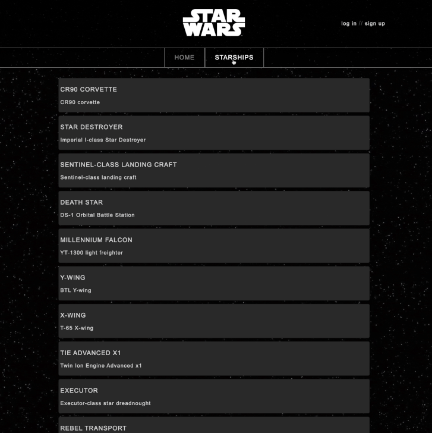

# STAR WARS REACT APP

Aplicacion que permite ver los detalles de todas las naves estelares de Star Wars.

## DEMO

Se puede visualizar el proyecto [aqui](https://bazza6.github.io/Star-Wars-API/)

## DESCRIPCION

En el proyecto se han utilizado las siguientes tecnologias: Reat 18 con Hooks, React Routing 6, styled-components, Jest y React Testing Library.
Las informaciones sobre las naves se obtienen atrevez una llamada a la API de [SWAPI](https://swapi.dev/) y las imagen se recuperan desde la pagina [Star Wars a Visual Guide](https://starwars-visualguide.com/). Se ha implementado un simple sistema de login que guarda los datos en localstorage para poder acceder a la lista de las naves.

